# Lead Generation & Email Automation System - System Design

## 🎯 System Overview

```
┌─────────────────────────────────────────────────────────────────────────────────────────────────────────────────┐
│                                    LEAD GENERATION & EMAIL AUTOMATION SYSTEM                                   │
│                                                                                                                 │
│  A comprehensive multi-channel outreach platform for B2B lead generation with AI-powered personalization       │
└─────────────────────────────────────────────────────────────────────────────────────────────────────────────────┘
```

## 🏗️ High-Level Architecture

```
┌─────────────────────────────────────────────────────────────────────────────────────────────────────────────────┐
│                                                                                                                 │
│  ┌─────────────────────────────────────────────────────────────────────────────────────────────────────────────┐ │
│  │                                           USER INTERFACE LAYER                                              │ │
│  │  ┌─────────────────┐  ┌─────────────────┐  ┌─────────────────┐  ┌─────────────────┐  ┌─────────────────┐ │ │
│  │  │  Next.js App   │  │  Dashboard     │  │  Lead Manager  │  │  Campaign      │  │  Analytics     │ │ │
│  │  │  (React 19)    │  │  (Real-time)   │  │  (CSV Import)  │  │  (A/B Testing) │  │  (Reports)     │ │ │
│  │  │  (SSR/SSG)     │  │  (Tailwind)    │  │  (Validation)  │  │  (Templates)   │  │  (ROI)         │ │ │
│  │  └─────────────────┘  └─────────────────┘  └─────────────────┘  └─────────────────┘  └─────────────────┘ │ │
│  └─────────────────────────────────────────────────────────────────────────────────────────────────────────────┘ │
│                                                                                                                 │
│  ┌─────────────────────────────────────────────────────────────────────────────────────────────────────────────┐ │
│  │                                           API GATEWAY LAYER                                                │ │
│  │  ┌─────────────────┐  ┌─────────────────┐  ┌─────────────────┐  ┌─────────────────┐  ┌─────────────────┐ │ │
│  │  │  Email API     │  │  Follow-up API │  │  SMS API       │  │  WhatsApp API  │  │  AI Services   │ │ │
│  │  │  (/send-email) │  │  (/send-follow) │  │  (/send-sms)   │  │  (/list-whatsapp)│ │ (/ai-smart)   │ │ │
│  │  │  (Rate Limited)│  │  (Scheduled)   │  │  (Twilio)      │  │  (Twilio)      │  │  (GPT-4)       │ │ │
│  │  └─────────────────┘  └─────────────────┘  └─────────────────┘  └─────────────────┘  └─────────────────┘ │ │
│  └─────────────────────────────────────────────────────────────────────────────────────────────────────────────┘ │
│                                                                                                                 │
│  ┌─────────────────────────────────────────────────────────────────────────────────────────────────────────────┐ │
│  │                                           BUSINESS LOGIC LAYER                                              │ │
│  │  ┌─────────────────┐  ┌─────────────────┐  ┌─────────────────┐  ┌─────────────────┐  ┌─────────────────┐ │ │
│  │  │  Lead Scoring  │  │  Duplicate     │  │  Quota         │  │  Template      │  │  Follow-up     │ │ │
│  │  │  Engine        │  │  Prevention    │  │  Management    │  │  Management    │  │  Scheduler     │ │ │
│  │  │  (AI-Powered)  │  │  (Deduplication)│  │  (Daily Limits) │  │  (A/B Testing) │  │  (Dynamic)     │ │ │
│  │  └─────────────────┘  └─────────────────┘  └─────────────────┘  └─────────────────┘  └─────────────────┘ │ │
│  └─────────────────────────────────────────────────────────────────────────────────────────────────────────────┘ │
│                                                                                                                 │
│  ┌─────────────────────────────────────────────────────────────────────────────────────────────────────────────┐ │
│  │                                           DATA PROCESSING LAYER                                             │ │
│  │  ┌─────────────────┐  ┌─────────────────┐  ┌─────────────────┐  ┌─────────────────┐  ┌─────────────────┐ │ │
│  │  │  CSV Parser    │  │  Email         │  │  Contact       │  │  Enrichment    │  │  Validation    │ │ │
│  │  │  (Multi-format) │  │  Normalizer   │  │  Deduplicator  │  │  (AI Research) │  │  Engine        │ │ │
│  │  └─────────────────┘  └─────────────────┘  └─────────────────┘  └─────────────────┘  └─────────────────┘ │ │
│  └─────────────────────────────────────────────────────────────────────────────────────────────────────────────┘ │
│                                                                                                                 │
│  ┌─────────────────────────────────────────────────────────────────────────────────────────────────────────────┐ │
│  │                                           COMMUNICATION LAYER                                              │ │
│  │  ┌─────────────────┐  ┌─────────────────┐  ┌─────────────────┐  ┌─────────────────┐  ┌─────────────────┐ │ │
│  │  │  Gmail API     │  │  Twilio SMS    │  │  Twilio Voice  │  │  WhatsApp      │  │  Email Threads │ │ │
│  │  │  (OAuth2)      │  │  (Programmatic) │  │  (Click-to-Call)│  │  (Business API)│  │  (Management)  │ │ │
│  │  │  (Thread Mgmt) │  │  (Delivery)    │  │  (Recording)   │  │  (Templates)   │  │  (History)     │ │ │
│  │  └─────────────────┘  └─────────────────┘  └─────────────────┘  └─────────────────┘  └─────────────────┘ │ │
│  └─────────────────────────────────────────────────────────────────────────────────────────────────────────────┘ │
│                                                                                                                 │
│  ┌─────────────────────────────────────────────────────────────────────────────────────────────────────────────┐ │
│  │                                           STORAGE & PERSISTENCE LAYER                                        │ │
│  │  ┌─────────────────┐  ┌─────────────────┐  ┌─────────────────┐  ┌─────────────────┐  ┌─────────────────┐ │ │
│  │  │  Firebase       │  │  Firestore     │  │  LocalStorage  │  │  Cache         │  │  Session       │ │ │
│  │  │  Auth          │  │  (NoSQL)       │  │  (Settings)    │  │  (API Response) │  │  Management    │ │ │
│  │  │  (Google OAuth)│  │  (Real-time)   │  │  (Templates)   │  │  (Aggressive)  │  │  (State)       │ │ │
│  │  └─────────────────┘  └─────────────────┘  └─────────────────┘  └─────────────────┘  └─────────────────┘ │ │
│  └─────────────────────────────────────────────────────────────────────────────────────────────────────────────┘ │
│                                                                                                                 │
│  ┌─────────────────────────────────────────────────────────────────────────────────────────────────────────────┐ │
│  │                                           MONITORING & ANALYTICS LAYER                                       │ │
│  │  ┌─────────────────┐  ┌─────────────────┐  ┌─────────────────┐  ┌─────────────────┐  ┌─────────────────┐ │ │
│  │  │  Error Handler │  │  Performance   │  │  Usage Metrics │  │  Conversion    │  │  Revenue       │ │ │
│  │  │  (Centralized) │  │  Monitoring    │  │  (Quota Tracking)│  │  Funnel        │  │  Forecasting   │ │ │
│  │  │  (Retry Logic) │  │  (CPU/Network) │  │  (Daily/Weekly) │  │  (Analytics)   │  │  (AI-Powered)  │ │ │
│  │  └─────────────────┘  └─────────────────┘  └─────────────────┘  └─────────────────┘  └─────────────────┘ │ │
│  └─────────────────────────────────────────────────────────────────────────────────────────────────────────────┘ │
│                                                                                                                 │
└─────────────────────────────────────────────────────────────────────────────────────────────────────────────────┘
```

## 📊 Data Flow Architecture

```
┌─────────────────────────────────────────────────────────────────────────────────────────────────────────────────┐
│                                            DATA FLOW ARCHITECTURE                                              │
├─────────────────────────────────────────────────────────────────────────────────────────────────────────────────┤
│                                                                                                                 │
│  ┌─────────────┐    ┌─────────────┐    ┌─────────────┐    ┌─────────────┐    ┌─────────────┐    ┌─────────────┐│
│  │   USER      │───▶│   CSV       │───▶│   LEAD      │───▶│   SCORING   │───▶│   EMAIL     │───▶│   GMAIL     ││
│  │   UPLOAD    │    │   PARSER    │    │   PROCESSING│    │   ENGINE    │    │   CRAFTING  │    │   API       ││
│  └─────────────┘    └─────────────┘    └─────────────┘    └─────────────┘    └─────────────┘    └─────────────┘│
│                                                                                                                 │
│  ┌─────────────┐    ┌─────────────┐    ┌─────────────┐    ┌─────────────┐    ┌─────────────┐    ┌─────────────┐│
│  │   FIREBASE  │◀───│   QUOTA     │◀───│   SENDING   │◀───│   TEMPLATE  │◀───│   AI        │◀───│   GPT-4     ││
│  │   STORAGE   │    │   CHECK     │    │   LOGIC     │    │   ENGINE    │    │   SERVICES  │    │   API       ││
│  └─────────────┘    └─────────────┘    └─────────────┘    └─────────────┘    └─────────────┘    └─────────────┘│
│                                                                                                                 │
│  ┌─────────────┐    ┌─────────────┐    ┌─────────────┐    ┌─────────────┐    ┌─────────────┐    ┌─────────────┐│
│  │   ANALYTICS │◀───│   TRACKING  │◀───│   RESPONSE  │◀───│   WEBHOOK   │◀───│   REPLY     │◀───│   INCOMING  ││
│  │   DASHBOARD │    │   SYSTEM    │    │   HANDLER   │    │   PROCESSOR │    │   MONITOR   │    │   EMAILS    ││
│  └─────────────┘    └─────────────┘    └─────────────┘    └─────────────┘    └─────────────┘    └─────────────┘│
│                                                                                                                 │
│  ┌─────────────┐    ┌─────────────┐    ┌─────────────┐    ┌─────────────┐    ┌─────────────┐    ┌─────────────┐│
│  │   FOLLOW-UP │───▶│   SCHEDULER │───▶│   QUEUE     │───▶│   RATE      │───▶│   TWILIO    │───▶│   SMS/VOICE ││
│  │   GENERATOR │    │   (Cron)    │    │   MANAGER   │    │   LIMITER   │    │   API       │    │   DELIVERY  ││
│  └─────────────┘    └─────────────┘    └─────────────┘    └─────────────┘    └─────────────┘    └─────────────┘│
│                                                                                                                 │
└─────────────────────────────────────────────────────────────────────────────────────────────────────────────────┘
```

## 🔄 Core Workflows

### 1. CSV Import & Lead Processing Workflow

```
┌─────────────────────────────────────────────────────────────────────────────────────────────────────────────────┐
│                                      CSV IMPORT & LEAD PROCESSING WORKFLOW                                     │
├─────────────────────────────────────────────────────────────────────────────────────────────────────────────────┤
│                                                                                                                 │
│  [START] User Uploads CSV File                                                                                    │
│    │                                                                                                             │
│    ▼                                                                                                             │
│  ┌─────────────────────────────────────────────────────────────┐                                              │
│  │  1. FILE VALIDATION                                           │                                              │
│  │  • Check file format (.csv)                                    │                                              │
│  │  • Validate file size limits                                   │                                              │
│  │  • Parse CSV headers and data rows                            │                                              │
│  └─────────────────────────────────────────────────────────────┘                                              │
│    │                                                                                                             │
│    ▼                                                                                                             │
│  ┌─────────────────────────────────────────────────────────────┐                                              │
│  │  2. DATA NORMALIZATION                                         │                                              │
│  │  • Normalize line endings (CRLF → LF)                        │                                              │
│  │  • Trim whitespace from headers and values                   │                                              │
│  │  • Extract and validate email addresses                       │                                              │
│  │  • Format phone numbers for international dialing             │                                              │
│  └─────────────────────────────────────────────────────────────┘                                              │
│    │                                                                                                             │
│    ▼                                                                                                             │
│  ┌─────────────────────────────────────────────────────────────┐                                              │
│  │  3. FIELD MAPPING & AUTO-DETECTION                            │                                              │
│  │  • Extract template variables from email templates            │                                              │
│  │  • Auto-map CSV columns to template variables                 │                                              │
│  │  • Apply common field mappings (email, phone, business, etc.) │                                              │
│  │  • Allow manual field mapping overrides                        │                                              │
│  └─────────────────────────────────────────────────────────────┘                                              │
│    │                                                                                                             │
│    ▼                                                                                                             │
│  ┌─────────────────────────────────────────────────────────────┐                                              │
│  │  4. LEAD QUALIFICATION & SCORING                              │                                              │
│  │  • Filter by lead quality (HOT/WARM/COLD)                     │                                              │
│  │  • Calculate lead scores using AI-powered scoring engine       │                                              │
│  │  • Identify decision makers and key contacts                  │                                              │
│  │  • Validate contact information completeness                  │                                              │
│  └─────────────────────────────────────────────────────────────┘                                              │
│    │                                                                                                             │
│    ▼                                                                                                             │
│  ┌─────────────────────────────────────────────────────────────┐                                              │
│  │  5. DEDUPLICATION & CONTACT MANAGEMENT                         │                                              │
│  │  • Remove duplicate email addresses                           │                                              │
│  │  • Merge duplicate phone numbers                              │                                              │
│  │  • Check against previously contacted leads                   │                                              │
│  │  • Create unique contact identifiers                          │                                              │
│  └─────────────────────────────────────────────────────────────┘                                              │
│    │                                                                                                             │
│    ▼                                                                                                             │
│  ┌─────────────────────────────────────────────────────────────┐                                              │
│  │  6. STATE MANAGEMENT & PREVIEW                                │                                              │
│  │  • Store processed contacts in state                          │                                              │
│  │  • Generate preview recipient for template testing            │                                              │
│  │  • Update UI with contact counts and statistics              │                                              │
│  │  • Enable email campaign configuration                         │                                              │
│  └─────────────────────────────────────────────────────────────┘                                              │
│    │                                                                                                             │
│    ▼                                                                                                             │
│  [END] Ready for Email Campaign Configuration                                                              │
└─────────────────────────────────────────────────────────────────────────────────────────────────────────────────┘
```

### 2. Email Sending & Campaign Workflow

```
┌─────────────────────────────────────────────────────────────────────────────────────────────────────────────────┐
│                                      EMAIL SENDING & CAMPAIGN WORKFLOW                                         │
├─────────────────────────────────────────────────────────────────────────────────────────────────────────────────┤
│                                                                                                                 │
│  [START] User Initiates Email Campaign                                                                          │
│    │                                                                                                             │
│    ▼                                                                                                             │
│  ┌─────────────────────────────────────────────────────────────┐                                              │
│  │  1. PRE-SEND VALIDATION                                      │                                              │
│  │  • Check daily email quota (500/day limit)                    │                                              │
│  │  • Validate email template subject and body                  │                                              │
│  │  • Verify Gmail OAuth token is valid                          │                                              │
│  │  • Confirm user intent (if confirmation enabled)             │                                              │
│  └─────────────────────────────────────────────────────────────┘                                              │
│    │                                                                                                             │
│    ▼                                                                                                             │
│  ┌─────────────────────────────────────────────────────────────┐                                              │
│  │  2. TEMPLATE PERSONALIZATION                                 │                                              │
│  │  • Replace template variables with contact data              │                                              │
│  │  • Apply A/B testing logic (if enabled)                       │                                              │
│  │  • Process email images and attachments                      │                                              │
│  │  • Generate personalized subject lines                       │                                              │
│  └─────────────────────────────────────────────────────────────┘                                              │
│    │                                                                                                             │
│    ▼                                                                                                             │
│  ┌─────────────────────────────────────────────────────────────┐                                              │
│  │  3. DUPLICATE PREVENTION                                      │                                              │
│  │  • Check against previously sent emails                       │                                              │
│  │  • Filter out already contacted leads                         │                                              │
│  │  • Apply manual contact status overrides                     │                                              │
│  │  • Respect user's "do not contact" preferences               │                                              │
│  └─────────────────────────────────────────────────────────────┘                                              │
│    │                                                                                                             │
│    ▼                                                                                                             │
│  ┌─────────────────────────────────────────────────────────────┐                                              │
│  │  4. RATE-LIMITED SENDING                                     │                                              │
│  │  • Send emails in batches (respecting Gmail limits)          │                                              │
│  │  • Apply 5-second delays between sends                        │                                              │
│  │  • Monitor sending progress and update UI                     │                                              │
│  │  • Handle rate limit errors gracefully                        │                                              │
│  └─────────────────────────────────────────────────────────────┘                                              │
│    │                                                                                                             │
│    ▼                                                                                                             │
│  ┌─────────────────────────────────────────────────────────────┐                                              │
│  │  5. GMAIL API INTEGRATION                                    │                                              │
│  │  • Authenticate with OAuth2 token                            │                                              │
│  │  • Send emails via Gmail API                                 │                                              │
│  │  • Manage email threads for follow-ups                       │                                              │
│  │  • Track delivery status and message IDs                     │                                              │
│  └─────────────────────────────────────────────────────────────┘                                              │
│    │                                                                                                             │
│    ▼                                                                                                             │
│  ┌─────────────────────────────────────────────────────────────┐                                              │
│  │  6. TRACKING & STORAGE                                       │                                              │
│  │  • Store sent email records in Firestore                       │                                              │
│  │  • Update daily email count                                   │                                              │
│  │  • Log A/B test assignments and results                       │                                              │
│  │  • Track campaign metrics (opens, clicks, replies)            │                                              │
│  └─────────────────────────────────────────────────────────────┘                                              │
│    │                                                                                                             │
│    ▼                                                                                                             │
│  [END] Campaign Complete - Analytics Updated                                                             │
└─────────────────────────────────────────────────────────────────────────────────────────────────────────────────┘
```

### 3. Follow-up & Auto-Reply Workflow

```
┌─────────────────────────────────────────────────────────────────────────────────────────────────────────────────┐
│                                      FOLLOW-UP & AUTO-REPLY WORKFLOW                                            │
├─────────────────────────────────────────────────────────────────────────────────────────────────────────────────┤
│                                                                                                                 │
│  [START] Incoming Email Received or Follow-up Scheduled                                                       │
│    │                                                                                                             │
│    ▼                                                                                                             │
│  ┌─────────────────────────────────────────────────────────────┐                                              │
│  │  1. EMAIL PROCESSING (Incoming) / SCHEDULING (Follow-up)      │                                              │
│  │  • Parse email content and headers                            │                                              │
│  │  • Extract sender information and thread ID                    │                                              │
│  │  • Classify intent (interested, not interested, etc.)          │                                              │
│  │  • Determine optimal follow-up timing                          │                                              │
│  └─────────────────────────────────────────────────────────────┘                                              │
│    │                                                                                                             │
│    ▼                                                                                                             │
│  ┌─────────────────────────────────────────────────────────────┐                                              │
│  │  2. AI-POWERED RESPONSE GENERATION                           │                                              │
│  │  • Analyze conversation history                              │                                              │
│  │  • Generate context-aware responses                          │                                              │
│  │  • Maintain professional B2B tone                             │                                              │
│  │  • Include relevant CTAs (Calendly, demos, etc.)              │                                              │
│  └─────────────────────────────────────────────────────────────┘                                              │
│    │                                                                                                             │
│    ▼                                                                                                             │
│  ┌─────────────────────────────────────────────────────────────┐                                              │
│  │  3. FOLLOW-UP LOGIC & RULES                                 │                                              │
│  │  • Apply dynamic follow-up intervals                         │                                              │
│  │  • Hot leads: 1, 3, 7 days                                  │                                              │
│  │  • Warm leads: 3, 7, 14 days                                 │                                              │
│  │  • Cold leads: 7, 14, 30 days                                │                                              │
│  │  • Maximum 3 follow-ups per lead                              │                                              │
│  └─────────────────────────────────────────────────────────────┘                                              │
│    │                                                                                                             │
│    ▼                                                                                                             │
│  ┌─────────────────────────────────────────────────────────────┐                                              │
│  │  4. QUOTA & RATE LIMITING                                    │                                              │
│  │  • Check daily follow-up quota                               │                                              │
│  │  • Respect minimum 2-day interval between follow-ups         │                                              │
│  │  • Apply rate limiting to prevent spam detection             │                                              │
│  │  • Handle quota exceeded scenarios                            │                                              │
│  └─────────────────────────────────────────────────────────────┘                                              │
│    │                                                                                                             │
│    ▼                                                                                                             │
│  ┌─────────────────────────────────────────────────────────────┐                                              │
│  │  5. MULTI-CHANNEL DELIVERY                                   │                                              │
│  │  • Send follow-up via Email (primary)                        │                                              │
│  │  • Send WhatsApp follow-up (if enabled)                      │                                              │
│  │  • Send SMS follow-up (if enabled)                           │                                              │
│  │  • Log delivery status across all channels                  │                                              │
│  └─────────────────────────────────────────────────────────────┘                                              │
│    │                                                                                                             │
│    ▼                                                                                                             │
│  ┌─────────────────────────────────────────────────────────────┐                                              │
│  │  6. LEAD STATUS UPDATES                                     │                                              │
│  │  • Mark leads as replied (if positive response)              │                                              │
│  │  • Update lead scores based on engagement                     │                                              │
│  │  • Schedule next follow-up (if needed)                        │                                              │
│  │  • Update analytics and conversion funnel                     │                                              │
│  └─────────────────────────────────────────────────────────────┘                                              │
│    │                                                                                                             │
│    ▼                                                                                                             │
│  [END] Follow-up Complete - Lead Nurtured                                                          │
└─────────────────────────────────────────────────────────────────────────────────────────────────────────────────┘
```

## 🗄️ Database Architecture

```
┌─────────────────────────────────────────────────────────────────────────────────────────────────────────────────┐
│                                            FIREBASE DATABASE ARCHITECTURE                                      │
├─────────────────────────────────────────────────────────────────────────────────────────────────────────────────┤
│                                                                                                                 │
│  ┌─────────────────────────────────────────────────────────────┐                                              │
│  │                    COLLECTION STRUCTURE                      │                                              │
│  │                                                             │                                              │
│  │  users/                                                      │                                              │
│  │  ├── {userId}/                                               │                                              │
│  │  │   ├── settings/                                           │                                              │
│  │  │   │   └── templates/                                      │                                              │
│  │  │   │       ├── senderName                                 │                                              │
│  │  │   │       ├── senderEmail                                │                                              │
│  │  │   │       ├── templateA (subject, body)                   │                                              │
│  │  │   │       ├── templateB (subject, body)                   │                                              │
│  │  │   │       ├── whatsappTemplate                           │                                              │
│  │  │   │       ├── smsTemplate                                │                                              │
│  │  │   │       ├── fieldMappings                              │                                              │
│  │  │   │       └── userPreferences                            │                                              │
│  │  │   ├── sent_emails/                                       │                                              │
│  │  │   │   ├── {emailId}                                      │                                              │
│  │  │   │   │   ├── recipientEmail                             │                                              │
│  │  │   │   │   ├── recipientName                              │                                              │
│  │  │   │   │   ├── subject                                    │                                              │
│  │  │   │   │   ├── sentAt                                     │                                              │
│  │  │   │   │   ├── templateUsed                               │                                              │
│  │  │   │   │   └── threadId                                   │                                              │
│  │  │   ├── replied_leads/                                     │                                              │
│  │  │   │   ├── {emailId}                                      │                                              │
│  │  │   │   │   ├── repliedAt                                  │                                              │
│  │  │   │   │   ├── replyContent                               │                                              │
│  │  │   │   │   └── aiAnalysis                                 │                                              │
│  │  │   ├── follow_up_tasks/                                   │                                              │
│  │  │   │   ├── {taskId}                                       │                                              │
│  │  │   │   │   ├── recipientEmail                             │                                              │
│  │  │   │   │   ├── scheduledFor                               │                                              │
│  │  │   │   │   ├── status (pending/completed)                 │                                              │
│  │  │   │   │   └── followUpCount                             │                                              │
│  │  │   ├── manual_contact_status/                             │                                              │
│  │  │   │   ├── {contactKey}                                   │                                              │
│  │  │   │   │   ├── contacted (true/false)                     │                                              │
│  │  │   │   │   └── notes                                      │                                              │
│  │  │   ├── activity/                                          │                                              │
│  │  │   │   ├── {activityId}                                   │                                              │
│  │  │   │   │   ├── type (email/sms/whatsapp/call)             │                                              │
│  │  │   │   │   ├── timestamp                                  │                                              │
│  │  │   │   │   └── details                                    │                                              │
│  │  │   └── deals/                                             │                                              │
│  │  │       ├── {dealId}                                       │                                              │
│  │  │       │   ├── company                                    │                                              │
│  │  │       │   ├── value                                      │                                              │
│  │  │       │   ├── stage (lead/qualified/proposal/closed)     │                                              │
│  │  │       │   └── probability                                │                                              │
│  └─────────────────────────────────────────────────────────────┘                                              │
│                                                                                                                 │
│  ┌─────────────────────────────────────────────────────────────┐                                              │
│  │                    INDEXES & PERFORMANCE                       │                                              │
│  │  • Compound indexes on (userId, sentAt) for sent_emails     │                                              │
│  │  • Indexes on recipientEmail for quick lookup               │                                              │
│  │  • Indexes on scheduledFor for follow-up task queries       │                                              │
│  │  • Real-time listeners for dashboard updates                 │                                              │
│  │  • Offline persistence with local caching                    │                                              │
│  └─────────────────────────────────────────────────────────────┘                                              │
│                                                                                                                 │
└─────────────────────────────────────────────────────────────────────────────────────────────────────────────────┘
```

## 🔧 Technology Stack

```
┌─────────────────────────────────────────────────────────────────────────────────────────────────────────────────┐
│                                            TECHNOLOGY STACK                                                   │
├─────────────────────────────────────────────────────────────────────────────────────────────────────────────────┤
│                                                                                                                 │
│  ┌─────────────────┐  ┌─────────────────┐  ┌─────────────────┐  ┌─────────────────┐  ┌─────────────────┐ │
│  │   FRONTEND     │  │   BACKEND      │  │   DATABASE     │  │   INTEGRATIONS │  │   AI/ML        │ │
│  │                │  │                │  │                │  │                │  │                │ │
│  │ • Next.js 16   │  │ • Node.js      │  │ • Firebase      │  │ • Gmail API    │  │ • OpenAI GPT-4 │ │
│  │ • React 19     │  │ • Next.js API  │  │ • Firestore     │  │ • Twilio       │  │ • AI Research  │ │
│  │ • Tailwind CSS │  │ • REST Routes  │  │ • Real-time     │  │ • WhatsApp     │  │ • Smart Outreach│ │
│  │ • Firebase SDK │  │ • Middleware   │  │ • Auth          │  │ • Google OAuth │  │ • Auto-Reply    │ │
│  │ • React Hooks  │  │ • Error Handler│  │ • Storage       │  │ • Webhooks     │  │ • Lead Scoring │ │
│  └─────────────────┘  └─────────────────┘  └─────────────────┘  └─────────────────┘  └─────────────────┘ │
│                                                                                                                 │
│  ┌─────────────────┐  ┌─────────────────┐  ┌─────────────────┐  ┌─────────────────┐  ┌─────────────────┐ │
│  │   DEVOPS       │  │   MONITORING   │  │   SECURITY     │  │   PERFORMANCE  │  │   DEPLOYMENT  │ │
│  │                │  │                │  │                │  │                │  │                │ │
│  │ • Git          │  │ • Error Logging │  │ • Firebase Auth │  │ • Caching      │  │ • Vercel       │ │
│  │ • Version Ctrl │  │ • Performance  │  │ • OAuth2        │  │ • Memoization  │  │ • CI/CD        │ │
│  │ • Testing      │  │ • Analytics    │  │ • Rate Limiting│  │ • Lazy Loading │  │ • Environment  │ │
│  │ • Code Quality │  │ • Health Checks│  │ • Input Validation│ │ • Optimization │  │ • Staging      │ │
│  └─────────────────┘  └─────────────────┘  └─────────────────┘  └─────────────────┘  └─────────────────┘ │
│                                                                                                                 │
└─────────────────────────────────────────────────────────────────────────────────────────────────────────────────┘
```

## 🚀 Deployment Architecture

```
┌─────────────────────────────────────────────────────────────────────────────────────────────────────────────────┐
│                                          DEPLOYMENT ARCHITECTURE                                              │
├─────────────────────────────────────────────────────────────────────────────────────────────────────────────────┤
│                                                                                                                 │
│  ┌─────────────────────────────────────────────────────────────┐                                              │
│  │                    PRODUCTION ENVIRONMENT                    │                                              │
│  │  • Vercel Platform (Serverless Functions)                   │                                              │
│  │  • Firebase Hosting (Static Assets)                        │                                              │
│  │  • Firebase Firestore (Database)                            │                                              │
│  │  • Firebase Authentication (User Management)                │                                              │
│  │  • CDN for Static Assets (Vercel Edge Network)              │                                              │
│  └─────────────────────────────────────────────────────────────┘                                              │
│                                                                                                                 │
│  ┌─────────────────────────────────────────────────────────────┐                                              │
│  │                    MONITORING & OBSERVABILITY                 │                                              │
│  │  • Vercel Analytics (Performance Monitoring)                │                                              │
│  • Firebase Crashlytics (Error Tracking)                        │                                              │
│  • Custom Error Handler (Centralized Logging)                   │                                              │
│  • Performance Monitoring (CPU/Network Usage)                   │                                              │
│  • Health Check Endpoints (API Status)                          │                                              │
│  └─────────────────────────────────────────────────────────────┘                                              │
│                                                                                                                 │
│  ┌─────────────────────────────────────────────────────────────┐                                              │
│  │                    SCALING & PERFORMANCE                       │                                              │
│  │  • Automatic Scaling (Vercel Serverless)                      │                                              │
│  • Aggressive Caching (API Responses)                           │                                              │
│  • Client-side Memoization (React Hooks)                        │                                              │
│  • Lazy Loading (Non-critical Components)                       │                                              │
│  • Rate Limiting (API Quotas)                                   │                                              │
│  └─────────────────────────────────────────────────────────────┘                                              │
│                                                                                                                 │
└─────────────────────────────────────────────────────────────────────────────────────────────────────────────────┘
```

## 📈 System Architecture Diagram (Mermaid)

```mermaid
flowchart TB
    subgraph UI [User Interface]
        A[Next.js Dashboard] -->|CSV Upload| B[Lead Manager]
        A -->|Campaign Config| C[Email Campaign]
        A -->|Analytics View| D[Analytics Dashboard]
    end

    subgraph API [API Layer]
        E[/api/send-email/] -->|Validation| F[Quota Manager]
        G[/api/send-followup/] -->|Scheduling| H[Follow-up Scheduler]
        I[/api/send-sms/] -->|Twilio| J[Twilio API]
        K[/api/list-whatsapp-contacts/] -->|Query| L[Firebase Firestore]
        M[/api/ai-smart-outreach/] -->|GPT-4| N[OpenAI API]
        O[/api/auto-reply-processor/] -->|Analysis| P[AI Intent Classifier]
    end

    subgraph Logic [Business Logic]
        Q[Lead Scoring Engine] -->|Score| R[Contact Deduplicator]
        S[Template Engine] -->|Personalize| T[Email Crafter]
        U[Duplicate Prevention] -->|Filter| V[Contact Manager]
        W[Rate Limiter] -->|Throttle| X[Queue Manager]
    end

    subgraph Storage [Data Layer]
        Y[Firebase Auth] -->|Authenticate| Z[User Sessions]
        AA[Firebase Firestore] -->|Store| AB[Sent Emails]
        AA -->|Store| AC[Replied Leads]
        AA -->|Store| AD[Follow-up Tasks]
        AA -->|Store| AE[User Settings]
        AF[LocalStorage] -->|Cache| AG[Templates & Preferences]
    end

    subgraph External [External Services]
        AH[Gmail API] -->|Send| AI[Email Delivery]
        AJ[Twilio SMS] -->|Send| AK[SMS Delivery]
        AL[Twilio Voice] -->|Call| AM[Call Recording]
        AN[OpenAI GPT-4] -->|Generate| AO[AI Responses]
    end

    subgraph Monitoring [Monitoring & Analytics]
        AP[Error Handler] -->|Log| AQ[Centralized Logging]
        AR[Performance Monitor] -->|Track| AS[CPU/Network Metrics]
        AT[Usage Tracker] -->|Monitor| AU[Daily Quotas]
        AV[Conversion Funnel] -->|Analyze| AW[ROI Analytics]
    end

    A --> E
    A --> G
    A --> I
    A --> M
    B --> Q
    C --> S
    E --> F
    F --> U
    U --> T
    T --> AH
    G --> H
    H --> W
    W --> X
    X --> G
    I --> J
    M --> N
    N --> AO
    O --> P
    P --> AO
    E --> AA
    G --> AA
    I --> AA
    M --> AA
    O --> AA
    AA --> AP
    AP --> AQ
    AR --> AS
    AT --> AU
    AV --> AW

    classDef external fill:#f0f0f0,stroke:#333,stroke-width:1px;
    class AH,AJ,AL,AN external;
```



## 📊 Key Metrics & Quotas

```
┌─────────────────────────────────────────────────────────────────────────────────────────────────────────────────┐
│                                            SYSTEM LIMITS & QUOTAS                                              │
├─────────────────────────────────────────────────────────────────────────────────────────────────────────────────┤
│                                                                                                                 │
│  ┌─────────────────────────────────────────────────────────────┐                                              │
│  │                    DAILY QUOTAS                              │                                              │
│  │  • Email Sending: 500 emails/day per user                   │                                              │
│  │  • SMS Sending: 50 SMS/day per user                         │                                              │
│  │  • Voice Calls: 30 calls/day per user                       │                                              │
│  │  • WhatsApp Messages: 100 messages/day per user             │                                              │
│  └─────────────────────────────────────────────────────────────┘                                              │
│                                                                                                                 │
│  ┌─────────────────────────────────────────────────────────────┐                                              │
│  │                    RATE LIMITING                             │                                              │
│  │  • Email: 5-second delay between sends                     │                                              │
│  │  • SMS: 10-second delay between sends                      │                                              │
│  │  • API Calls: 100 requests/minute per endpoint              │                                              │
│  │  • Follow-ups: Minimum 2-day interval between contacts     │                                              │
│  └─────────────────────────────────────────────────────────────┘                                              │
│                                                                                                                 │
│  ┌─────────────────────────────────────────────────────────────┐                                              │
│  │                    PERFORMANCE TARGETS                      │                                              │
│  │  • Page Load Time: < 2 seconds                              │                                              │
│  │  • API Response Time: < 500ms (p95)                         │                                              │
│  │  • CSV Processing: < 5 seconds for 10K records             │                                              │
│  │  • Email Sending: 50 emails/minute (rate limited)          │                                              │
│  └─────────────────────────────────────────────────────────────┘                                              │
│                                                                                                                 │
└─────────────────────────────────────────────────────────────────────────────────────────────────────────────────┘
```

---

**System Version:** 2.0  
**Last Updated:** July 2026  
**Architecture Type:** Serverless Multi-Channel Outreach Platform  
**Scale:** Enterprise-Grade • Fully Automated • AI-Powered
